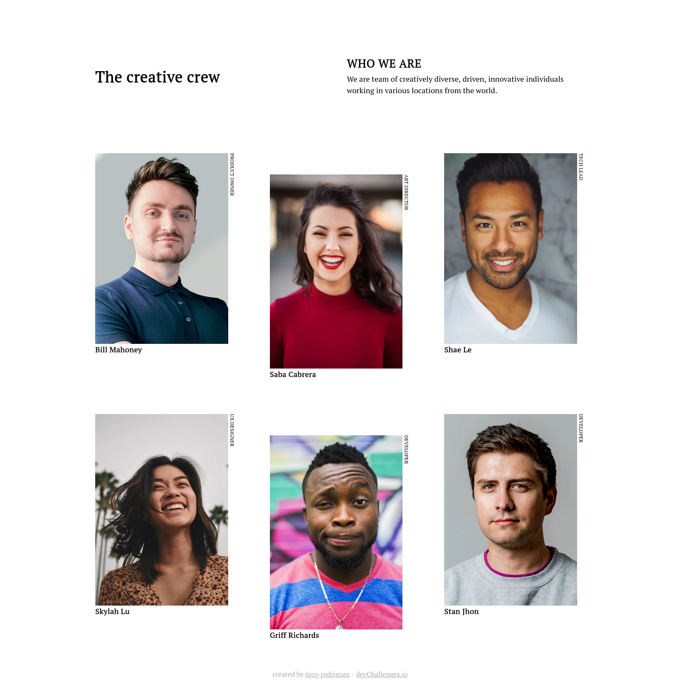

<h1 align="center">My Team Page</h1>

   Solution for a challenge from  <a href="http://devchallenges.io" target="_blank">Devchallenges.io</a>.

  <h3>
    <a href="https://my-team-page-45cce8.netlify.app/">
      Solution
    </a>
     | 
    <a href="https://devchallenges.io/challenges/hhmesazsqgKXrTkYkt0U">
      Challenge
    </a>
  </h3>

## Overview

Visit [https://my-team-page-45cce8.netlify.app/](https://my-team-page-45cce8.netlify.app/)

Desktop

Mobile

## Features

This application/site was created as a submission to a [DevChallenges](https://devchallenges.io/challenges) challenge. The [challenge](https://devchallenges.io/challenges/hhmesazsqgKXrTkYkt0U) was to build an application to complete the given user stories.

The images are positioned differently with respect to each other. This is done through CSS grid, media queries and child selectors. On large screen devices, the grid has 3 columns and the children `3n-1` are given a margin at the top. These correspond to the child positioned at the middle of each row. The rest of the children don't have margin at the top. This creates the zig-zag effect. On small screen devices, the grid has 2 columns, so now the even children are given the margin at the top.
